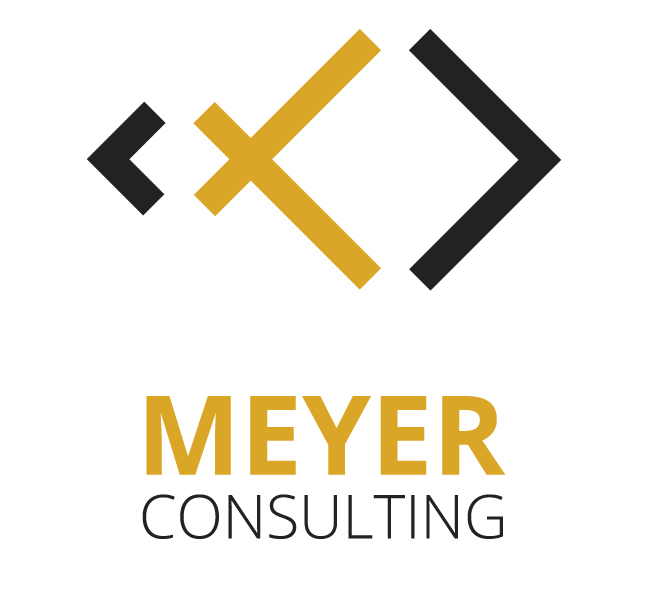

# MEYER CONSULTING - WITH A REAL PASSION FOR TEACHING AND DEVELOPING

    

## 👨‍💻 ABOUT ME

I'am a Freelance Trainer and Fullstack-Developer.
I  to work with React, .NET Core and Azure.
More than 14 years of experience.
Based near Munich, Germany.

 

## 🚀 MOTIVATION

My focus is the holistic implementation of software solutions directed towards the efficient and secure use of the latest technologies. I view myself as solution-oriented and target-oriented "Fullstack Technology Enthusiast".

When working with you I will be looking for the best tools that match your unique situation and deliver on your individual goals. During the process paradigms are getting challenged and different technologies will be evaluated to get to the most efficient solutions.

Due to my long and diverse practical experience, I am able to offer you a knowledge transfer that is oriented towards your individual challenges.

My main goal is to enable you to profit sustainably from the transferred knowledge and to apply it independently.

 

## 💌 Contact

    <b>Mail:</b>  <a href="mailto:info@meyer-consultingnet">info@meyer-consulting.net</a> 

    <b>Twitter:</b>  <a href="https://twitter.com/roeb" target="_blank">@roeb</a>

    <b>Discord:</b>  <a href="https://discord.gg/mB4VKcjkTS" target="_blank">#meyer-consulting</a>

